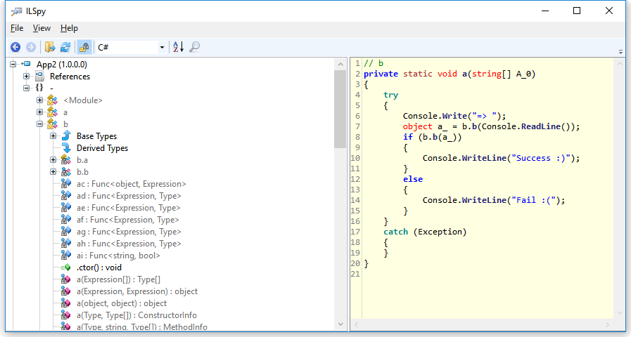
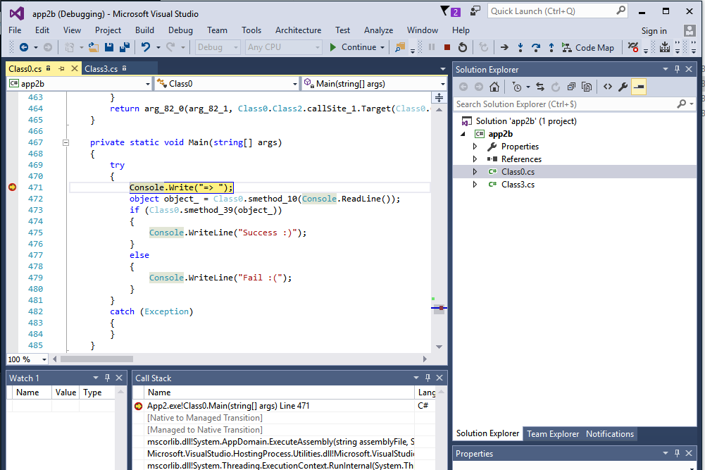
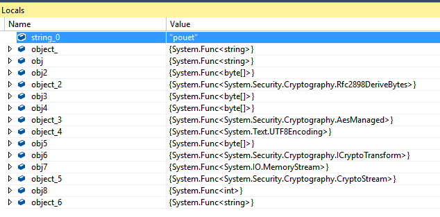
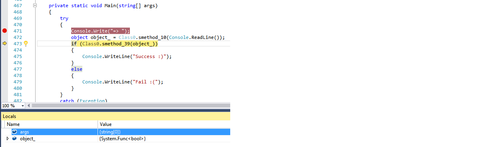
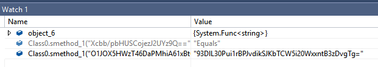
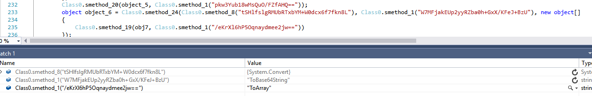

# Description

This challenge is named .net and description is "Obfuscation". This challenge also contains a file named *app2.exe*. 

You can download a zip file containing this file here : [app2.exe.zip](RE5/app2.exe.zip)

# Solution

## Discover the application

Let's try to run the application. 

```
C:\tmp\RE5>app2.exe
=> test
Fail :(
```

The application display `=>` then wait for input and then display `Fail :(`. We can deduce that we have to find the password to display a success. 

## Basic decompilation

Challenge name is *.net*, let use [ILSPY](http://www.ilspy.net), a .net decompiler, to see what is under the file. 



As expected, this is an obfuscated .net application. 

After looking at the obfuscated source code, the easiest way to find the password would be to run the application and debug it. ILSpy allows to save code as a valid Visual Studio project, this will allow us to run and debug the application. Unfortunately the application has been obfuscated and can't be decompiled as is because some method has the same name and parameter and differ only by return type which is valid in MSIL but not in C#.


## Deobfuscation

Let use [de4dot](http://de4dot.com/), a .net deobfuscation tool to rewrite the source code. 

```
de4dot -v -f app2.exe -o app2b.exe
```

In our case the main effect of *de4dot* is to replace variable and method name in order to avoid name collision. 

## Decompilation

We can now use the *"Save Code..."* feature of ILSpy.


The project opens in Visual Studio and we can debug source code. 



## Debugging

It seems that everything happens in the `smethod_10` method 

```cs
	private static object smethod_10(string string_0)
	{
		object object_ = Class0.smethod_27(Class0.smethod_25(Class0.smethod_8("sF56+GtNmLS3QZQdRrONb4h+iIsJ2YoI4bTUeVncdqhaI6nd5nhepA=="), Class0.smethod_1("tGixy7PvoLRoluCKauSB/PT3apjwnBNKxncF5ces7pk=")), Class0.smethod_1("X8UiICXNdI+fnPI4rtvBfJHOXc6B8MF+"));
		object obj = Class0.smethod_6(Class0.smethod_1("cmnQBMSbPQFSJuq1rf7pc7RAXFcViDCg"), object_);
		object obj2 = Class0.smethod_7();
		object object_2 = Class0.smethod_14(Class0.smethod_8("VdJBsf540mfICeznb7el1d6/tk5vxkQhhOCqa/1sHNhyVyH+HLRvpn+fz1bwyO/XgYm7EPLqfM4="), new object[]
		{
			obj,
			obj2,
			200000
		});
		object obj3 = Class0.smethod_18(object_2, Class0.smethod_1("z6oyc6zWY2DaANuazFyYjT/bW4vWN5eC"), new object[]
		{
			16
		});
		object obj4 = Class0.smethod_18(object_2, Class0.smethod_1("z6oyc6zWY2DaANuazFyYjT/bW4vWN5eC"), new object[]
		{
			16
		});
		object object_3 = Class0.smethod_15(Class0.smethod_8("Jf8ie+8XTpqWXWREgz3LvMbpKP/Koo6CxwLikD7aHMjjn9VGu4IXJreC17XNQVDqy8A8azIlg4oGHkV4S6J+jcHOTcCAMBeL9nkCleRM4B1uvBBI8liJktuN+QWCKOrerD7irijIsUosSsuxoAIBkFJibZjLJq6kC1tnbATEENo="));
		object object_4 = Class0.smethod_15(Class0.smethod_8("vslSo9XMaHDpAv3J7fJyzy5eZW65ngVKOE2jq2gGqmUUrKoUavgtRw=="));
		object obj5 = Class0.smethod_18(object_4, Class0.smethod_1("z6oyc6zWY2DaANuazFyYjT/bW4vWN5eC"), new object[]
		{
			string_0
		});
		object obj6 = Class0.smethod_18(object_3, Class0.smethod_1("Br20Smsyu4KP2KtiMlGQxuM3bPmmWU+5"), new object[]
		{
			obj3,
			obj4
		});
		object obj7 = Class0.smethod_15(Class0.smethod_8("jKcBWYLFXm18rRccy1+Pb92WPXrD/kOFEKBVSK2jnDg="));
		object object_5 = Class0.smethod_14(Class0.smethod_8("A0ePp61Uv+c5l3rfrFo7X3WZWZnk56MddHImtPH+Kr6rwFSireKHYXxDR50p7pB4NIt+yxM7Wyg="), new object[]
		{
			obj7,
			obj6,
			Class0.smethod_29(Class0.smethod_8("MqKDUlCPgkucOCCGV/K9W8kOOJNpOxl5Cs22Mf5WhJqg24+Q7Quxz/wopxsWVy+c0mo7gVrHdE4="), Class0.smethod_1("pddeibWLCkAgF2YYcP6C1Q=="))
		});
		object obj8 = Class0.smethod_27(obj5, Class0.smethod_1("77IlUtdWeSV7gClkB97Oiw=="));
		Class0.smethod_22(object_5, Class0.smethod_1("pddeibWLCkAgF2YYcP6C1Q=="), new object[]
		{
			obj5,
			0,
			obj8
		});
		Class0.smethod_20(object_5, Class0.smethod_1("pkw3Yub18wMsQuO/FZfAHQ=="));
		object object_6 = Class0.smethod_24(Class0.smethod_8("tSHlfslgRMUbRTxbYM+W0dcx6f7fkn8L"), Class0.smethod_1("W7MFjakEUp2yyRZba0h+GxX/KFeJ+BzU"), new object[]
		{
			Class0.smethod_19(obj7, Class0.smethod_1("/eKrXl6hP5Oqnaydmee2jw=="))
		});
		return Class0.smethod_18(object_6, Class0.smethod_1("Xcbb/pbHUSCojezJ2UYz9Q=="), new object[]
		{
			Class0.smethod_1("O1JOX5HWzT46DaPMhiA61xBtGMdyLvmqnWXjZ6K5yzs7qlTongtobDY52nC9V3pXL32/V22oxAw=")
		});
	}
```

If we look at local variable at the end of the method we can see that the code is working with `Func<>` which mean that the method only construct dynamic method and run them dynamically. 



The return of the smethod_10 is a `Func<Boolean>` which is send to `smethod_39` to determine if we succeed the challenge or not. If we look at the source code of `smethod_39` we see that it only execute the `Func<Boolean>` so the main work of this challenge will be to understand what happens in `smethod_10`. 



We now know that the `smethod_10` will test the input string and return a `boolean` to validate the challenge. 

Let's look at the last instruction of the `smethod_10` method. 

```cs
		return Class0.smethod_18(object_6, Class0.smethod_1("Xcbb/pbHUSCojezJ2UYz9Q=="), new object[]
		{
			Class0.smethod_1("O1JOX5HWzT46DaPMhiA61xBtGMdyLvmqnWXjZ6K5yzs7qlTongtobDY52nC9V3pXL32/V22oxAw=")
		});
```

The watch console can display what are the interesting variables.



- `object_6` is a `Func<String>`, after invoking it in the watch console (using this command `((Func<String>)object_6)()`) we see that the value is `4kRVaZhPfCT5Avq8kN4kYg==` which looks like base64 string. Unfortunately the decoded string doesn't look anything good so it should be a Byte array. 
- `Class0.smethod_1("O1JOX5HWzT46DaPMhiA61xBtGMdyLvmqnWXjZ6K5yzs7qlTongtobDY52nC9V3pXL32/V22oxAw="` is `93DlL30Pui1rBPJvdikSJKbTCW5i20WxxntB3zDvgTg=` which looks like base64 string. Once again, the decoded string doesn't look anything good, it should be a Byte array too. 
- `Class0.smethod_1("Xcbb/pbHUSCojezJ2UYz9Q==")` is "Equals". 

The last instruction tells us that we try to compare `object_6` to a constant !

`object_6` is 

```cs
		object object_6 = Class0.smethod_24(Class0.smethod_8("tSHlfslgRMUbRTxbYM+W0dcx6f7fkn8L"), Class0.smethod_1("W7MFjakEUp2yyRZba0h+GxX/KFeJ+BzU"), new object[]
		{
			Class0.smethod_19(obj7, Class0.smethod_1("/eKrXl6hP5Oqnaydmee2jw=="))
		});
```

The watch console help us decode the obfuscated string. 



We obtain this pseudo code 

```cs
		object object_6 = Class0.smethod_24(System.Convert, ToBase64String, new object[]
		{
			Class0.smethod_19(obj7, ToArray)
		});
```

`object_6` is only the base64 representation of `obj7`.

After digging in the code the same way, we can see that `obj7` is a `Func<MemoryStream>`. This `MemoryStream` is tied to a `CryptoStream` which is finally tied to the [`AesManaged`](https://msdn.microsoft.com/en-us/library/system.security.cryptography.aesmanaged.aspx) class. we now know that the flag is the AES decoded value of `93DlL30Pui1rBPJvdikSJKbTCW5i20WxxntB3zDvgTg=` 

AES is a symmetric encryption algorithm, it means we can get the decoded value if we get the key. 

After digging the same way in the source code, we obtain the AES key and can create the following program to retrieve the flag.

```cs
static void Main(string[] args)
{
    var obj = "Hello My Dear!App2, Version=1.0.0.0, Culture=neutral, PublicKeyToken=3b3d382fb8158bab";
    var obj2 = new Byte[8] { 0, 0, 0, 0, 0, 0, 0, 0 };
    Rfc2898DeriveBytes object_2 = new Rfc2898DeriveBytes(obj, obj2, 200000);

    var obj3 = object_2.GetBytes(16);
    var obj4 = object_2.GetBytes(16);

    var object_3 = AesManaged.Create();
    var object_4 = UTF8Encoding.UTF8;
    var decryptor = object_3.CreateDecryptor(obj3, obj4);

    // Create the streams used for decryption.
    using (MemoryStream msDecrypt = new MemoryStream(Convert.FromBase64String("93DlL30Pui1rBPJvdikSJKbTCW5i20WxxntB3zDvgTg=")))
    {
        using (CryptoStream csDecrypt = new CryptoStream(msDecrypt, decryptor, CryptoStreamMode.Read))
        {
            using (StreamReader srDecrypt = new StreamReader(csDecrypt))
            {

                // Read the decrypted bytes from the decrypting stream
                // and place them in a string.
                String plaintext = srDecrypt.ReadToEnd();

                Console.WriteLine(plaintext);
            }
        }
    }
}
``` 

There was few traps to get this program. 

1. We see that one part of the AES key is the fully qualified assembly name of the application. The original application is signed, so we have to use the original PublicKeyToken of the application2. 
2. `obj2` is a Byte array which is the result of the smethod_7 method, which after simplification is :  
    ```cs
	private static object smethod_7()
	{
		object obj = Class0.smethod_24({System.Convert}, "ToByteArray", new object[]
		{
			Class0.smethod_28({System.Diagnostics.Debugger}, "IsAttached")
		});
		object obj2 = Class0.smethod_24({System.Convert}, "ToByteArray", new object[]
		{
			Class0.smethod_25({System.ServiceModel.Activation.ListenerUnsafeNativeMethods}, "IsDebuggerPresent")
		});
		return Class0.smethod_31({System.Byte}, 8, new object[]
		{
			obj,
			obj2
		});
	}
    ```
    
    This method check if the debugger is attached or not and fill a byte array. When we find the key, the program was run with a debugger attached, it is not the case for the normal program execution, we should use an empty 8 bit array to have the valid value. 

After running this program, we obtain the  following string `I'm On top of the World!`

# Result 

Flag is `flag{I'm On top of the World!}`
